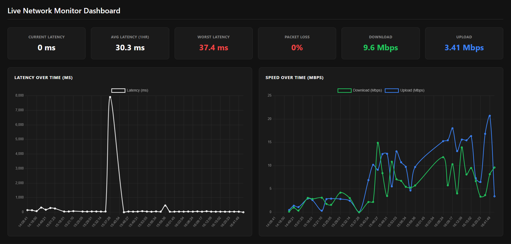

# Network Speed & Latency Monitor
 
A Python tool that monitors internet connection quality in real time,
measuring latency, packet loss, and download/upload speeds.
Built and run during my IT internship at NITDA (National Information
Technology Development Agency), collecting real network performance
data from government infrastructure.
 
## Dashboard Screenshot

 
## Technologies Used
- Python 3
- Flask (web server)
- pandas (data handling)
- schedule (automation)
- speedtest-cli (speed measurement)
- Chart.js (graphs)
 
## How to Run
```
git clone https://github.com/YOUR-USERNAME/network-monitor.git
cd network-monitor
python3 -m venv venv
source venv/bin/activate
pip install flask pandas schedule speedtest-cli
python3 monitor.py        # Terminal 1 -- data collector
python3 app.py            # Terminal 2 -- web dashboard
```
Open http://localhost:5000 in your browser.
 
## Sample Data (collected at NITDA, March 2026)
| Timestamp | Latency | Packet Loss | Download | Upload |
|-----------|---------|-------------|----------|--------|
| 14:39:50  | 318ms   | 50%         | 0.13Mbps | 0.47Mbps |
| 14:49:21  | 173ms   | 25%         | 1.01Mbps | 1.4Mbps  |
| 14:55:16  | 291ms   | 0%          | 0.35Mbps | 1.1Mbps  |
 
## What the Metrics Mean
**Latency** is the time in milliseconds for data to travel from your
computer to a server and back. Normal broadband latency is 10-50ms.
Values above 150ms cause noticeable delays in video calls and downloads.
 
**Packet loss** is the percentage of data packets that never arrive.
Even 1% packet loss causes audio glitches. Above 5% and most real-time
applications become unusable.
 
## Telecom Relevance
QoS (Quality of Service) monitoring is a core function of every
Network Operations Centre (NOC). This project demonstrates the same
measurements used by telecom engineers to assess and maintain network
performance across infrastructure.
